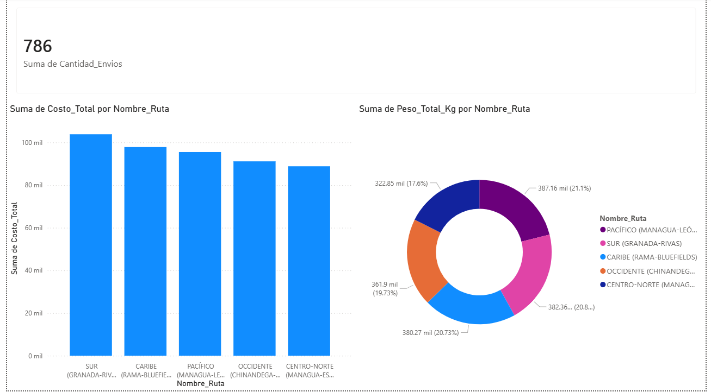
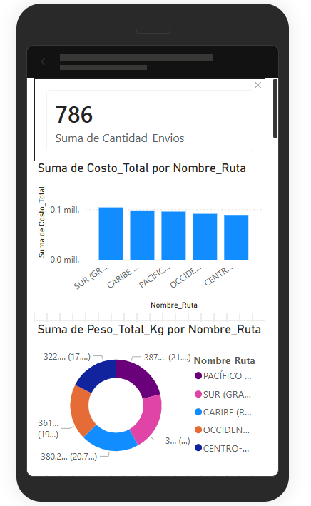
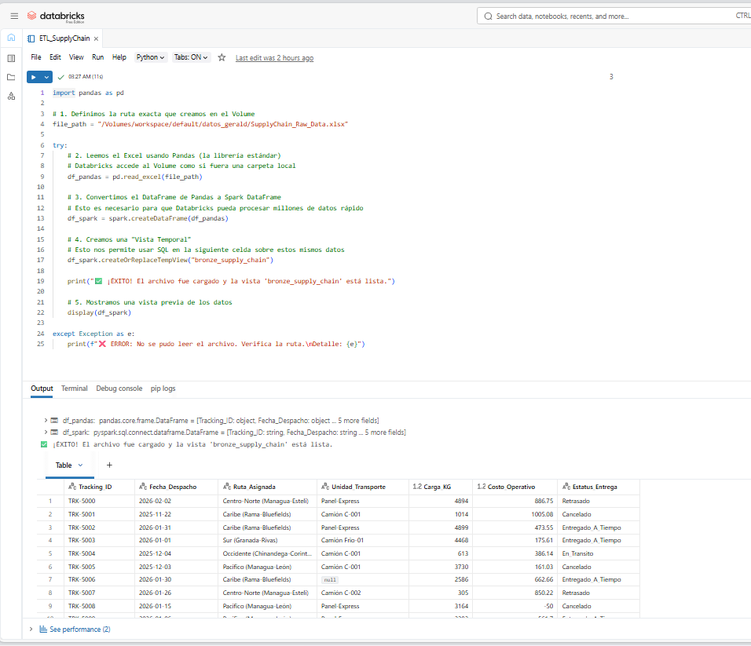
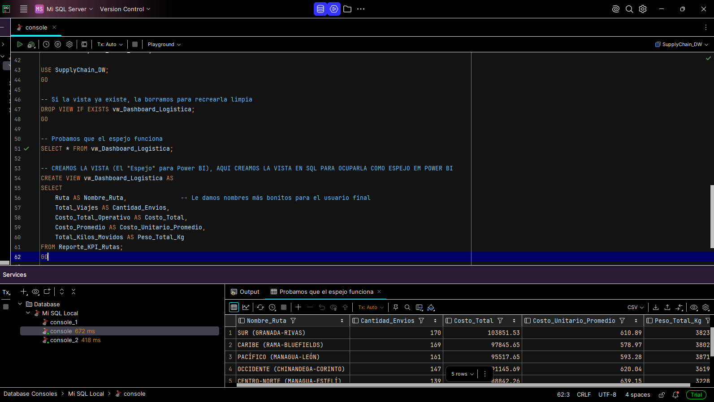

# 🚚 Supply Chain Analytics (End-to-End)

## 📌 Resumen Ejecutivo
Pipeline completo de Ingeniería de Datos diseñado para optimizar una red logística. El sistema ingesta datos crudos, los procesa en la nube mediante una arquitectura Medallion (Bronce/Plata/Oro) y alimenta un Dashboard ejecutivo para la toma de decisiones sobre costos y eficiencia de rutas.

## 🛠️ Arquitectura Tecnológica
Este proyecto simula un entorno empresarial moderno utilizando el siguiente flujo:

1.  **Python (Generador):** Script para crear datos sintéticos de envíos con inyección controlada de errores (valores nulos, costos negativos) para simular la realidad.
2.  **Azure Databricks (Procesamiento):**
    * **Capa Bronce:** Ingesta cruda de archivos Excel.
    * **Capa Plata:** Limpieza de datos y estandarización con Spark SQL.
    * **Capa Oro:** Agregación de KPIs financieros por ruta.
3.  **SQL Server (Data Warehouse):** Almacenamiento seguro de los datos finales modelados.
4.  **Power BI (Visualización):** Tableros interactivos y vista móvil para los stakeholders.

---

## 📷 Galería del Proyecto

### 1. El Resultado Final: Dashboard Ejecutivo (Power BI)
Una vista clara de los costos operativos y el volumen de carga por ruta.

### 2. Accesibilidad Total: Vista Móvil
Diseñado para que los gerentes tomen decisiones desde cualquier lugar.

  
   
  <em> </em>

### 3. El Motor en la Nube: Databricks (Spark SQL)
Procesamiento masivo y limpieza de datos utilizando notebooks en la nube.

### 4. La Bóveda de Datos: Modelo en SQL Server (DataGrip)
Estructura de almacenamiento final y creación de Vistas para desacoplar el reporte.

## 👤 Autor
**Gerald David Castillo Soto**
* Estudiante de Administración de Empresas & Data Engineering.
* Universidad Nacional Politécnica (UNP).
---