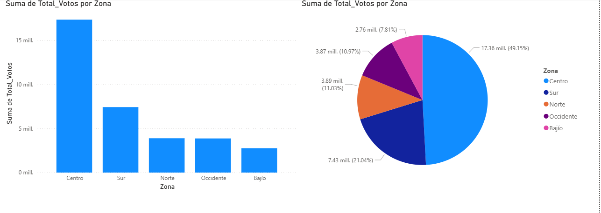
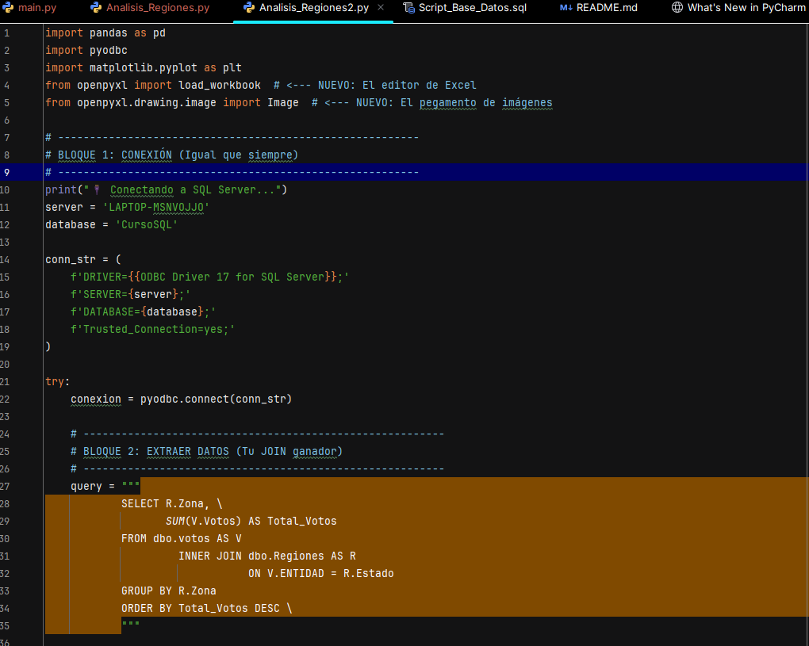
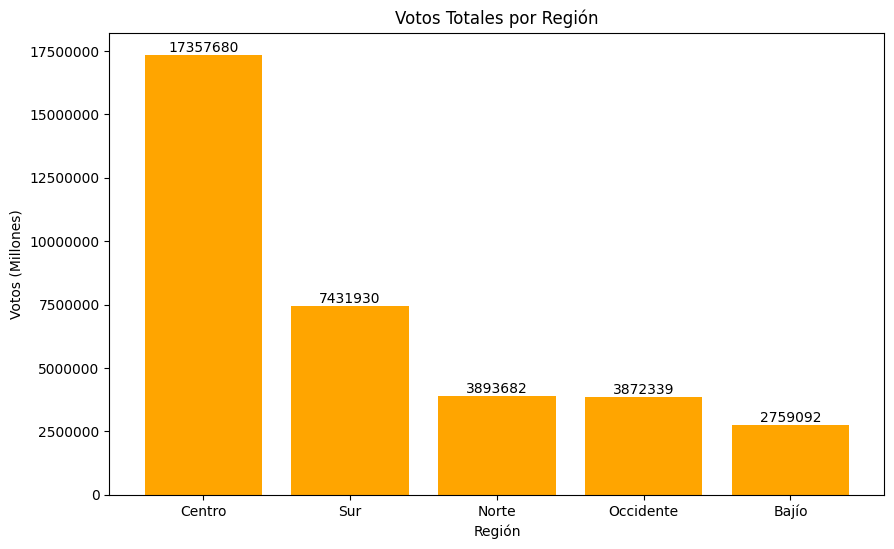

# 📊 Análisis Electoral: Pipeline de Datos (SQL + Python + Power BI)

Este proyecto implementa un flujo de trabajo completo de Ingeniería de Datos y Análisis para procesar resultados electorales, clasificarlos por zonas geográficas y visualizar los hallazgos.

---

<h3 align="center">🔹 Visualización Interactiva (Power BI)</h3>

  
   
  <i>Tablero dinámico con segmentación por zonas geográficas y partidos.</i>

 

<h3 align="center">🔹 Automatización del Backend</h3>

  
  &nbsp; &nbsp;
  

  <i>
    <b>Izquierda:</b> Script de Python conectando SQL Server y Pandas. 
    <b>Derecha:</b> Reporte en Excel generado y guardado automáticamente por el script.
  </i>

---

## 🚀 Tecnologías Utilizadas
El proyecto integra tres herramientas clave:
* **SQL Server:** Para el almacenamiento, limpieza y agregación masiva de datos (Vistas y Queries).
* **Python (Pandas & Matplotlib):** Para la conexión a base de datos, automatización de reportes en Excel y generación de gráficas estáticas.
* **Power BI:** Para la visualización interactiva y el storytelling de los datos.

---

## 📂 Estructura del Proyecto

| Archivo | Descripción |
| :--- | :--- |
| `Script_Base_Datos.sql` | Código SQL para crear tablas, insertar datos y generar la Vista de Regiones. |
| `Analisis_Regiones2.py` | Script principal de Python. Conecta a SQL, extrae data y genera Excel. |
| `Dashboard_Electoral.pbix` | Tablero interactivo de Power BI. |
| `Reporte_Electoral_Final.xlsx` | Resultado final del proceso automatizado. |

---

## 👤 Autor
**Gerald David Castillo Soto**
* Estudiante de Administración de Empresas & Data Engineering.
* Universidad Nacional Politécnica (UNP).

---